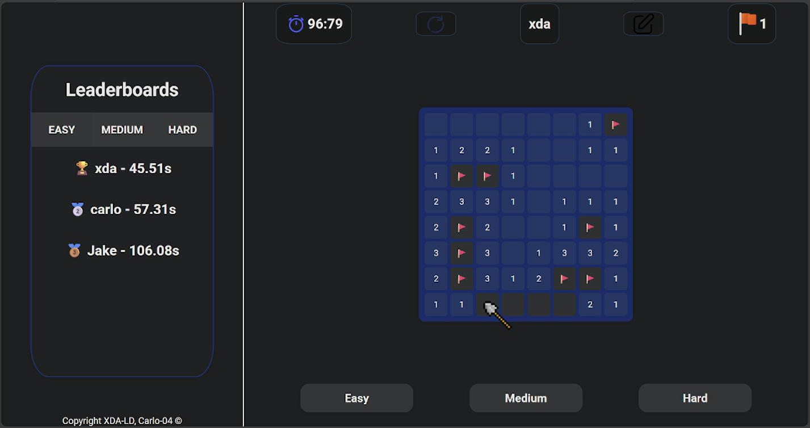

# Minesweeper (Vanilla JS)

A simple Minesweeper game made in plain HTML/CSS/JS. (Originally made for a web development course at LAU)

## How to run
- Open `index.html` in a browser, or
- Serve the folder:
  - `python -m http.server 8000`
  - Visit `http://localhost:8000`

## How to play
- Set player name
- Left click: reveal
- Right click: flag
Avoid the mines to win.